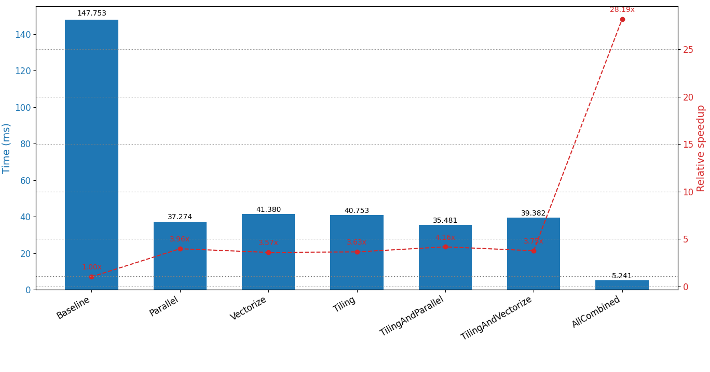

# TVM Optimization Analyzer

This project provides a comparison of several low-level optimization techniques for Neural Network operators using the Apache TVM compiler framework.

Specifically, the analysis focuses on a compute-intensive `Conv2D` operator, modeled after a typical layer from the conv3_x layer of a ResNet-50 architecture. The performance of various optimization schedules—including Tiling, Vectorization, etc. is benchmarked on a local Intel CPU.

## Getting Started

Follow these instructions to set up and run the project on your local machine.

### Prerequisites

-   Python 3.8+
-   Git

### Installation

1.  **Clone the repository:**
    ```bash
    git clone https://github.com/VThuong99/tvm_optimization_analyzer.git
    cd tvm_optimization_analyzer
    ```

2.  **Create and activate a virtual environment (recommended):**
    ```bash
    # For Windows
    python -m venv venv
    .\venv\Scripts\activate

    # For macOS/Linux
    python3 -m venv venv
    source venv/bin/activate
    ```

3.  **Install dependencies:**
    This project uses a nightly build of TVM for quick experimentation. The command below provides a simple way to install all necessary packages for experiment, that I learned from the [Machine Learning Compilation course](https://mlc-ai.translate.goog/summer22/?_x_tr_sl=en&_x_tr_tl=vi&_x_tr_hl=vi&_x_tr_pto=tc).
    ```
    pip install -r requirements.txt -f https://mlc.ai/wheels
    ```

## Run

```bash
python -m src.main
```

## Benchmark Results

The following results were obtained from running the analysis on the local machine specified below.

### Local Machine Specification

| Attribute               | Value                                         |
| ----------------------- | --------------------------------------------- |
| **CPU Name**            | Intel(R) Core(TM) i5-8250U CPU @ 1.60GHz        |
| **Architecture**        | Intel64 Family 6 Model 142 Stepping 10        |
| **Cores**               | 4                                             |
| **Logical Processors**  | 8                                             |
| **Max Clock Speed**     | 1800 MHz                                      |

### Performance Chart



## Evaluation on Google Colab

For easy replication and benchmarking on a different hardware environment, this repository includes an `experiments.ipynb` notebook file.

This notebook is specifically configured to run the entire analysis within a single cell on **Google Colab**, which typically provides access to **Intel Xeon CPUs**. This allows for a quick performance evaluation without any local setup and provides a valuable comparison point to the local benchmark results.
